ankr

brave-frontier-heroes
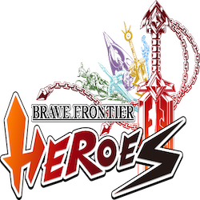
airswap

x2y2

hop-protocol

dex-ag

augur
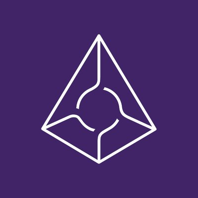
illuvium

axie-infinity
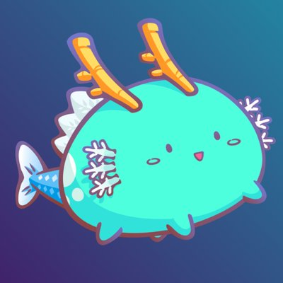
decentraland
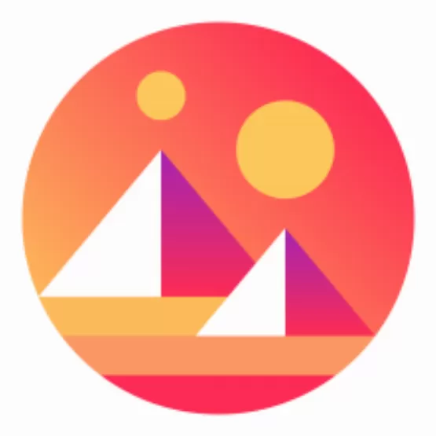
idex

convex-finance

gem
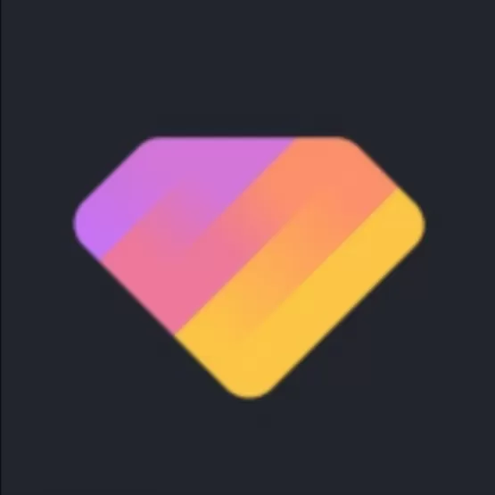
balancer

bancor
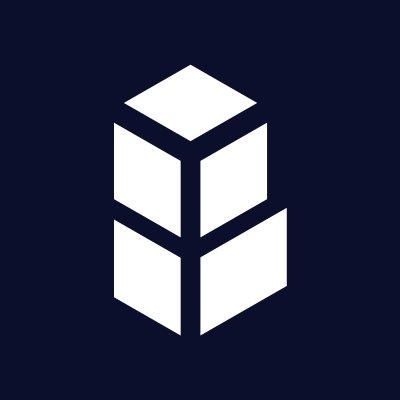
0x

aave-v2

meme
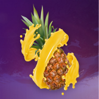
cream-finance
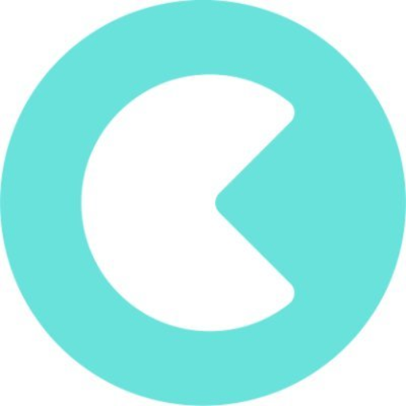
cryptokitties
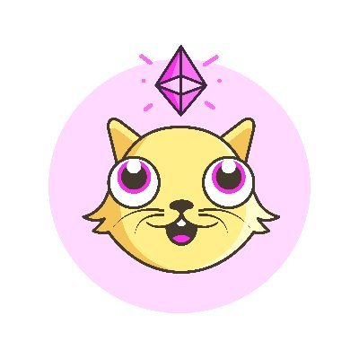
compound
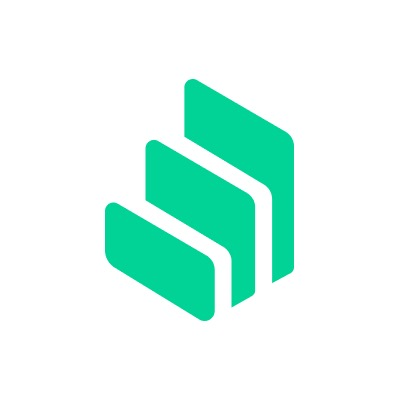
dutchx
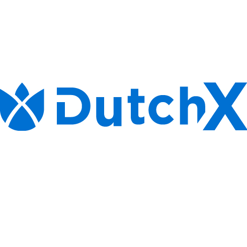
cryptopunks

status
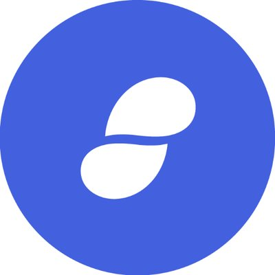
lido

liquity

sudoswap

sorare

sushiswap

looksrare

loopring

synapse

synthetix

paraswap

ren
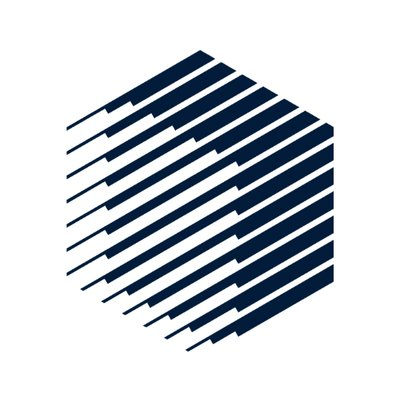
tokenlon

unicrypt

yearn-finance

uniswap

aave

dydx

instadapp

mirror

rocket-pool

set-protocol

tornado-cash

